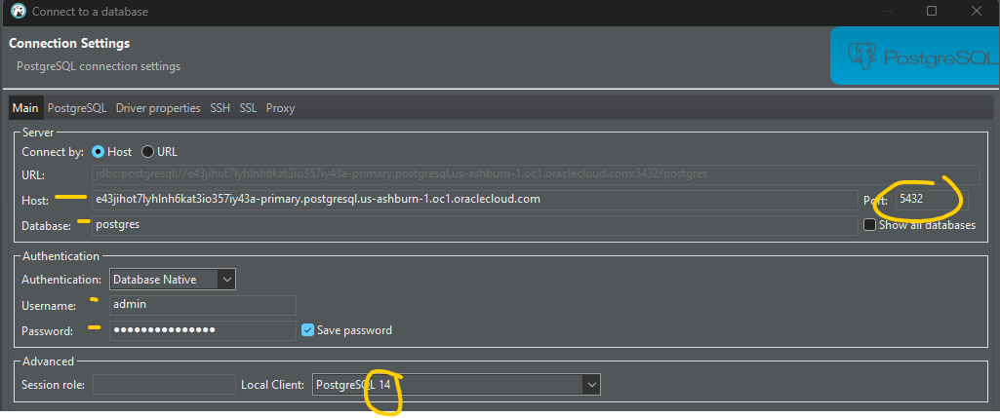
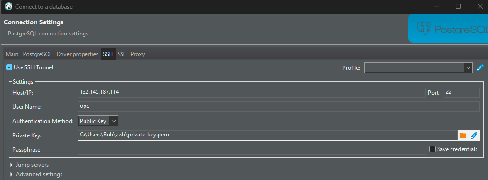
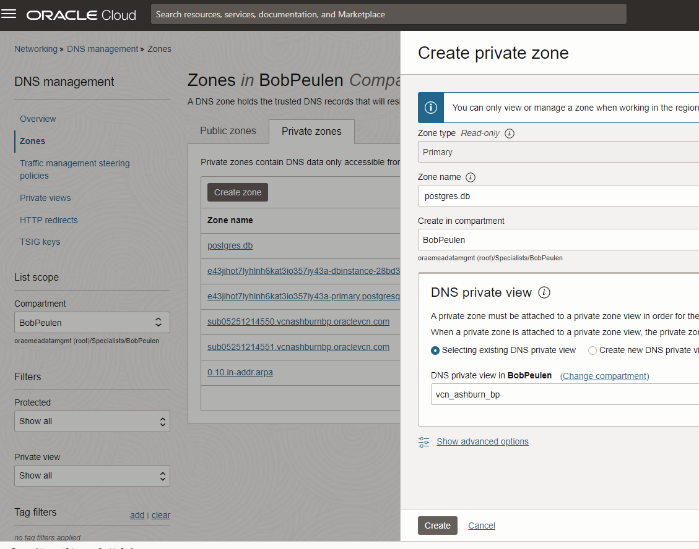
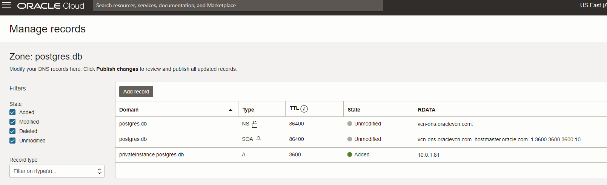
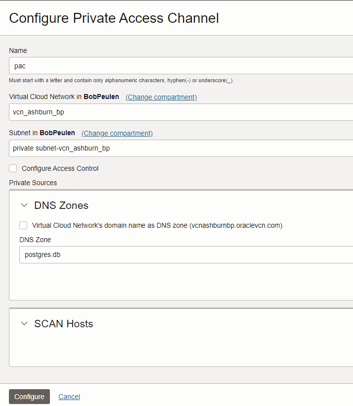
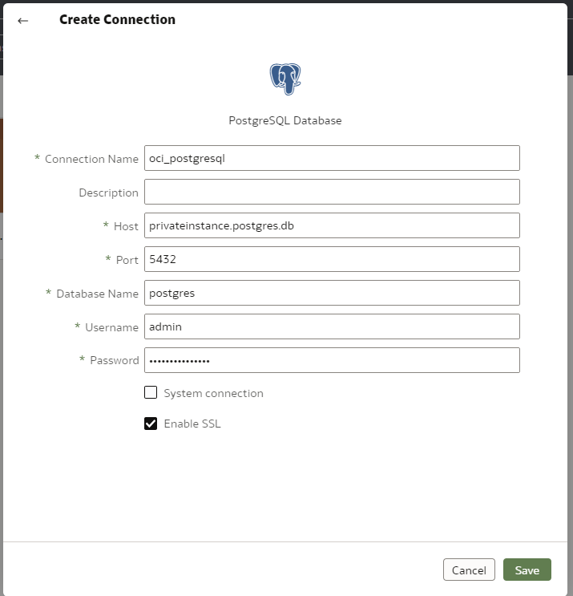
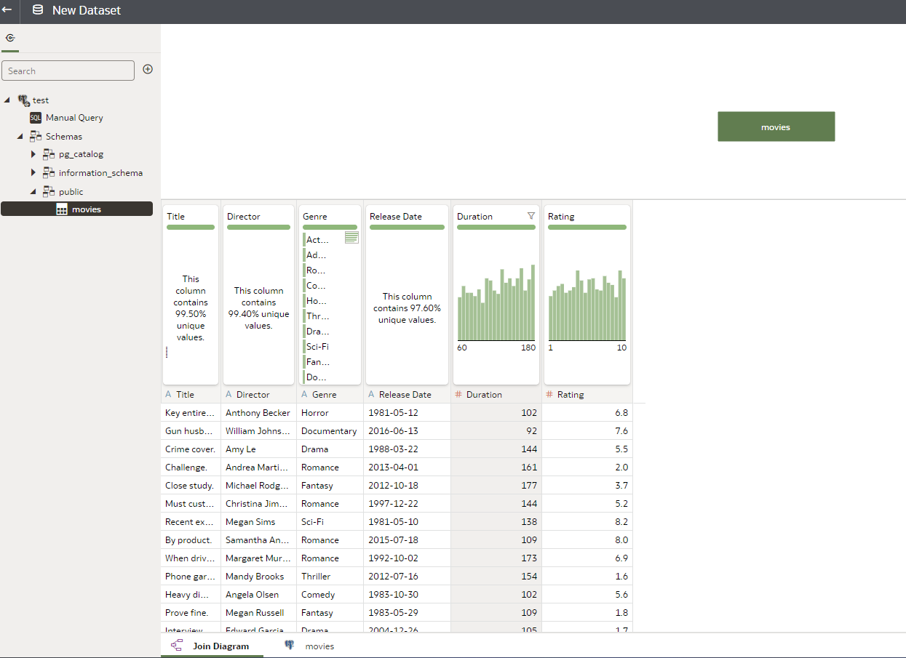

# Connect to OCI PostgreSQL, load data using DBeaver and connect to Oracle Analytics Cloud

- Create DB in private subnet
- Create instance in public subnet, same VCN
- Add port 5432 to private subnet security list

## See documentation here: https://www.postgresql.org/download/linux/redhat/

## SSH into the instance, make sure the instance is in the public subnet of the same VCN you provisioned the OCI PostgreSQL instance. Run the below command. This will install the client for PostgreSQL version 14. 
```
sudo dnf install -y https://download.postgresql.org/pub/repos/yum/reporpms/EL-8-x86_64/pgdg-redhat-repo-latest.noarch.rpm
sudo dnf -qy module disable postgresql
sudo dnf install -y postgresql14-server
sudo /usr/pgsql-14/bin/postgresql-14-setup initdb
sudo systemctl enable postgresql-14
sudo systemctl start postgresql-14
```

```rm -rf ~/.pgpass```

## Go to your OCI PostgreSQL overview page, click on **Copy** in the CA Certificate or download the certificate. Run the below command in the terminal.
```
sudo nano ./dbsystem.pub
```
Copy and paste the full certiface int he dbsystem.pub file. Save and close the file.

## Test the connection using the following command.
```psql -h [DB Private IP] -U [user name] -d postgres```

Example of statement: psql -h 10.0.1.81 -U admin -d postgres

## Run statement as test to review the connection.
```select version();```

# Connect as user
```psql "sslmode=verify-full sslrootcert=./dbsystem.pub host=<endpoint_fqdn> hostaddr=[DB private IP] dbname=postgres user=<user_name>"```

Example of fulll statement: psql "sslmode=verify-full sslrootcert=./dbsystem.pub host=e43jihot7lyhlnh6kat3io357iy43a-primary.postgresql.us-ashburn-1.oc1.oraclecloud.com hostaddr=10.0.1.81 dbname=postgres user=admin"

# Run something as test the connection is working.
```select version();```


# Connect using DBeaver

Install DBeaver locally and add the credentials to connect to the OCI PostgreSQL. See the screenshots. DBeaver will use the same instance in the publib subnet (using SSH) to be able to access the OCI PostgreSQL database.




### Load some data using DBeaver as table


# Connect using Oracle Analytis Cloud
- Create on OAC instance
- Create a new Private Zone in DNS management
- Add a record in the new private zone, pointing to the private ip/endpoint of the db




- Create a PAC for the OAC instance. Use the zone just created (not the record). Select the private subnet.


- Open OAC and create connection


